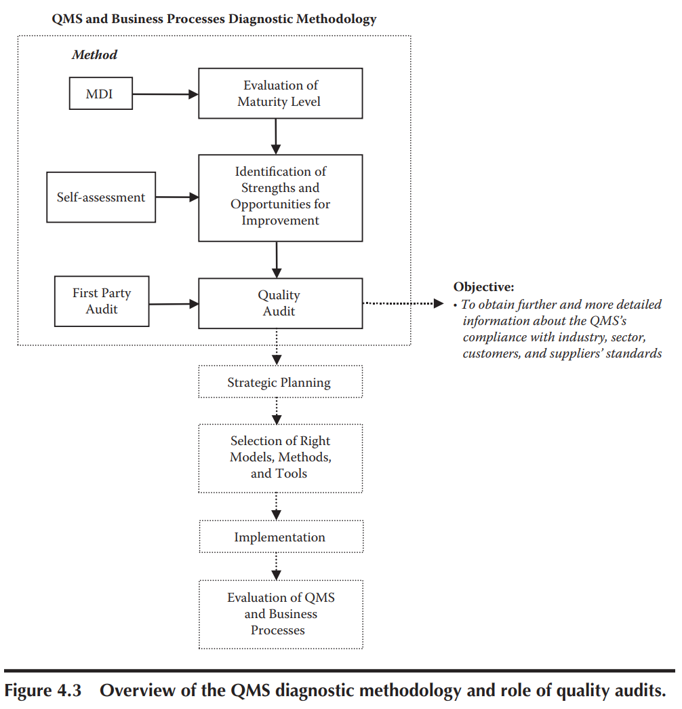
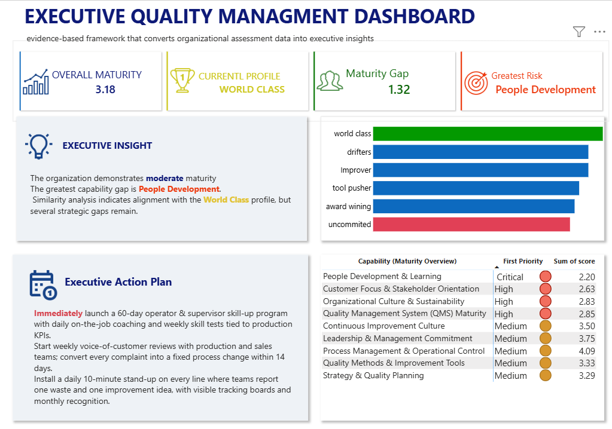

# Quality Maturity Decision Support System (QMDSS)

> **Transforming Quality Assessment Data into Executive Decisions**


---

## Executive Summary

The **Quality Maturity Decision Support System (QMDSS)** is an Executive Decision Support System designed to assess the maturity of an organization's Quality Management System (QMS) using the **Maturity Diagnostic Instrument (MDI)**.

Instead of simply collecting questionnaire responses, this project transforms assessment data into meaningful business insights that help management understand:

- Current Quality Maturity
- Organizational Capability Gaps
- Similarity to World-Class Organizations
- Strategic Improvement Priorities
- Executive-Level Decision Support

The project combines structured assessment, automated scoring, analytical models, and interactive Power BI dashboards into a complete workflow.

---

## Why This Project?

Many organizations invest in Lean, Six Sigma, ISO, or Continuous Improvement initiatives **before understanding whether their organization is mature enough to successfully implement them.**

Without a maturity assessment, improvement programs often become expensive initiatives with limited long-term impact.

QMDSS helps answer one fundamental question:

> **"Where are we today, and what should we improve first?"**

Instead of relying on intuition, the system provides an evidence-based assessment supported by data analysis and executive reporting.

---

## Project Objectives

This project aims to:

- Assess organizational Quality Maturity
- Identify capability strengths and weaknesses
- Measure organizational similarity against maturity profiles
- Support evidence-based management decisions
- Prioritize improvement initiatives
- Visualize results through an Executive Power BI Dashboard

---

## Key Features

- 84-question Quality Maturity Assessment
- Automated Weighted Scoring Engine
- Capability Analysis
- Organization Level Analysis
- Similarity Analysis
- Executive Dashboard
- Management Report
- Improvement Prioritization
- Confidential Assessment Workflow

---

> **Important Notice**

This repository **implements** the Maturity Diagnostic Instrument (MDI) methodology as a practical analytics and decision-support solution.

The original MDI methodology is described in:

**Rocha-Lona, L., Garza-Reyes, J. A., & Kumar, V. (2013). Building Quality Management Systems: Selecting the Right Methods and Tools. Springer.**

This repository is **not** the original methodology. It is an implementation designed to automate assessment, analysis, visualization, and executive reporting.
# Business Problem

Organizations continuously invest in Quality Management Systems (QMS), Lean Manufacturing, Six Sigma, ISO Standards, Operational Excellence, and Continuous Improvement initiatives.

However, one critical question is often overlooked:

> **"Is the organization mature enough to successfully implement these initiatives?"**

Many organizations adopt advanced quality tools without first understanding the maturity of their management systems. As a result, improvement programs frequently suffer from:

- Poor leadership commitment
- Weak employee engagement
- Inconsistent implementation
- Misaligned strategic objectives
- Low return on investment (ROI)
- Initiative fatigue caused by adopting management "fads"

Without a structured maturity assessment, management decisions are often based on intuition rather than objective organizational evidence.

---

# Proposed Solution

The **Quality Maturity Decision Support System (QMDSS)** provides an evidence-based framework that converts organizational assessment data into executive insights.

Instead of generating only survey results, the system transforms assessment responses into:

- Organizational Maturity Profile
- Capability Assessment
- Similarity Analysis
- Executive Dashboard
- Management Report
- Improvement Priorities

The objective is not simply to measure quality maturity, but to support strategic decision-making using reliable organizational data.

<p align="center">
  
</p>
*Figure 0. what is the main road map? .*
---

# Scientific Foundation

This project is based on the **Maturity Diagnostic Instrument (MDI)** presented in:

> Rocha-Lona, L., Garza-Reyes, J. A., & Kumar, V. (2013). *Building Quality Management Systems: Selecting the Right Methods and Tools*. Springer.

The methodology itself is derived from internationally recognized research in Quality Management and Organizational Maturity, particularly the six-level maturity model developed by Dale and Lascelles.

This repository does **not** introduce a new maturity model.

Instead, it implements the published methodology as an integrated assessment and decision-support system.

---

# Why MDI?

The Maturity Diagnostic Instrument (MDI) was developed to help organizations objectively evaluate the maturity of their Quality Management System (QMS).

Rather than focusing only on compliance, the framework evaluates whether quality has become an integrated organizational capability.

The assessment measures three fundamental dimensions:

- Organizational practices
- Management capabilities
- Continuous improvement culture

The resulting maturity profile enables organizations to understand their current position before selecting future improvement initiatives.

---

# Organizational Maturity Levels

The methodology classifies organizations into six maturity levels:

| Level | Description |
|--------|-------------|
| Level 1 | Uncommitted |
| Level 2 | Drifters |
| Level 3 | Tool Pushers |
| Level 4 | Improvers |
| Level 5 | Award Winners |
| Level 6 | World-Class |

These maturity profiles provide a structured roadmap for long-term organizational development rather than focusing solely on short-term quality improvements.

---

# Assessment Principles

According to the original methodology, reliable maturity assessment depends on several key principles:

- Cross-functional participation
- Multiple organizational perspectives
- Structured evaluation criteria
- Standardized scoring methodology
- Consistent assessment teams over time

Following these principles reduces subjective bias and improves the reliability of assessment results.

---

# Assessment Team

The assessment should **not** be completed by the Quality Department alone.

The recommended approach is to form a **multidisciplinary assessment team** representing different functional areas and organizational levels.

Suggested participants include:

- Top Management
- Middle Management
- Quality
- Production
- Materials
- Human Resources
- Supervisors
- Shop-floor Operators

The original methodology recommends an assessment team consisting of approximately **six participants** representing different organizational functions.

Maintaining the same assessment team during future evaluations improves consistency and minimizes subjective variation between assessment cycles.

---

# Assessment Scale

The MDI assessment consists of **84 indicators** evaluated using a **7-point Likert scale**.

The scoring scale ranges from:

| Score | Interpretation |
|------:|----------------|
| 1 | Strongly Agree / Best Practice |
| 2 | Agree |
| 3 | Slightly Agree |
| 4 | Neutral |
| 5 | Slightly Disagree |
| 6 | Disagree |
| 7 | Strongly Disagree / Critical Weakness |

Assessment responses are subsequently processed through the analytical workflow implemented in this repository.

---

> **Implementation Note**

The scientific methodology belongs to the original authors.

This repository focuses on implementing the complete analytical workflow, including data processing, weighted scoring, capability analysis, similarity analysis, executive visualization, and management reporting.
# System Architecture

The **Quality Maturity Decision Support System (QMDSS)** follows a structured end-to-end analytical workflow that transforms organizational assessment responses into executive-level decision support.

The implementation consists of multiple processing stages, beginning with questionnaire design and ending with management reporting.

---

## High-Level Architecture

```text
                MDI Framework
                      │
                      ▼
        Questionnaire Development
                      │
                      ▼
      Assessment Data Collection
             (Porsline Survey)
                      │
                      ▼
          Excel Response Dataset
                      │
                      ▼
             Data Validation
                      │
                      ▼
        Weighted Scoring Engine
                      │
                      ▼
      ┌───────────────┼───────────────┐
      ▼               ▼               ▼
Capability       Organization      Similarity
 Analysis       Level Analysis      Analysis
      └───────────────┼───────────────┘
                      ▼
          Executive Power BI Dashboard
                      │
                      ▼
         Executive Management Report
                      │
                      ▼
        Data-Driven Management Decisions
```

---

# System Components

The system consists of seven analytical modules.

| Module | Description |
|----------|-------------|
| Questionnaire | MDI assessment questionnaire |
| Data Collection | Organizational responses collected through Porsline |
| Scoring Engine | Automated weighted scoring using Excel formulas |
| Analytical Engine | Capability, maturity level and similarity calculations |
| Visualization | Interactive Power BI dashboard |
| Reporting | Executive management report |
| Decision Support | Prioritized improvement recommendations |

---

# Data Pipeline

The project follows a structured data pipeline.

```text
Questionnaire
      ↓
Survey Responses
      ↓
Raw Excel Data
      ↓
Data Cleaning
      ↓
Weighted Calculations
      ↓
Capability Scores
      ↓
Organization Maturity
      ↓
Similarity Analysis
      ↓
Dashboard
      ↓
Management Report
```

---

# Analytical Workflow

The analytical engine performs the following sequence:

### 1. Import Assessment Data

Assessment responses are exported from the questionnaire platform and imported into the scoring engine.

---

### 2. Validate Data

The system verifies:

- Missing responses
- Invalid values
- Data consistency
- Assessment completeness

---

### 3. Calculate Weighted Scores

Each assessment indicator is processed according to the MDI scoring methodology.

The engine automatically calculates weighted values required for maturity analysis.

---

### 4. Capability Analysis

Individual capability scores are calculated to identify organizational strengths and weaknesses.

Example capability dimensions include:

- Leadership
- Strategy
- Customer Focus
- Quality Management System
- Continuous Improvement
- Process Management
- People Development
- Organizational Culture
- Quality Methods

---

### 5. Organization Level Analysis

Overall organizational maturity is calculated using the aggregated capability scores.

The result represents the organization's current maturity level.

---

### 6. Similarity Analysis

The system compares the organization's assessment profile against the six maturity profiles defined by the MDI methodology.

The closest maturity profile is identified using similarity scoring.

---

### 7. Executive Dashboard

Processed analytical data is visualized using Power BI.

The dashboard provides:

- Overall Maturity
- Capability Analysis
- Similarity Score
- Organizational Profile
- Improvement Priorities

---

### 8. Executive Report

The final stage produces an executive-level report designed to support management decision-making.

The report summarizes:

- Current maturity level
- Organizational strengths
- Capability gaps
- Critical weaknesses
- Recommended improvement priorities

---

# System Outputs

The project produces multiple business outputs.

| Output | Purpose |
|---------|----------|
| Executive Dashboard | Interactive management visualization |
| Capability Analysis | Identify organizational strengths and weaknesses |
| Organization Level | Overall maturity assessment |
| Similarity Analysis | Compare against maturity profiles |
| Management Report | Executive summary for decision-makers |
| Improvement Priorities | Support strategic planning |

---

# Design Philosophy

This project was designed with one objective:

> **Transform assessment data into executive decisions.**

Rather than producing static reports, the system creates actionable business intelligence that helps organizations understand where they are today and where improvement efforts should be focused first.

---

# End-to-End Workflow

```text
Scientific Framework
        ↓
Assessment
        ↓
Data
        ↓
Analysis
        ↓
Insight
        ↓
Decision
        ↓
Continuous Improvement
```
# Repository Structure

The project is organized into independent modules to separate data collection, analytical processing, visualization, documentation, and reporting.

```text
QMDSS/
│
├── README.md
│
├── docs/
│   ├── methodology.md
│   ├── workflow.md
│   ├── dashboard-guide.md
│   └── screenshots/
│
├── questionnaire/
│   ├── mdi-questionnaire.pdf
│   ├── porsline-template.pdf
│   └── questionnaire-structure.xlsx
│
├── sample-data/
│   ├── raw-responses.xlsx
│   ├── processed-data.xlsx
│   └── anonymized-dataset.xlsx
│
├── excel-engine/
│   ├── scoring-engine.xlsx
│   ├── capability-analysis.xlsx
│   ├── similarity-analysis.xlsx
│   └── organization-level.xlsx
│
├── powerbi/
│   ├── QMDSS.pbix
│   ├── data-model.png
│   └── dashboard-preview.png
│
├── reports/
│   ├── executive-report.pdf
│   ├── capability-report.pdf
│   └── improvement-priorities.pdf
│
├── images/
│   ├── architecture.png
│   ├── workflow.png
│   ├── dashboard.png
│   └── screenshots/
│
└── references/
    ├── bibliography.md
    └── citations.bib
```

---

# Project Modules

The repository consists of several independent modules, each responsible for a specific stage of the assessment process.

| Module | Purpose |
|----------|---------|
| questionnaire | Assessment design and survey structure |
| sample-data | Example assessment data (anonymized) |
| excel-engine | Scoring calculations and analytical models |
| powerbi | Dashboard and visualization |
| reports | Executive reporting |
| docs | Technical documentation |
| images | Repository figures and screenshots |
| references | Scientific references |

---

# Folder Description

## docs/

Contains the complete project documentation, workflow explanation, methodology overview, and dashboard guide.

---

## questionnaire/

Contains the assessment questionnaire and supporting documents used to collect organizational responses.

The questionnaire is derived from the MDI framework described in the referenced publication.

---

## sample-data/

Contains anonymized demonstration datasets.

These files are provided exclusively for educational and demonstration purposes.

No confidential organizational information is included.

---

## excel-engine/

This folder contains the analytical core of the project.

The Excel Scoring Engine performs:

- Data validation
- Weighted scoring
- Capability calculations
- Organization maturity calculations
- Similarity calculations

This module transforms raw questionnaire responses into structured analytical outputs.

---

## powerbi/

Contains the Power BI report used for executive visualization.

The dashboard provides an interactive view of:

- Overall Maturity
- Capability Analysis
- Organization Profile
- Similarity Analysis
- Executive KPIs
- Improvement Priorities

---

## reports/

Contains executive reports generated from the processed assessment data.

Typical outputs include:

- Executive Summary
- Organizational Strengths
- Capability Gaps
- Recommended Improvement Priorities

---

## images/

Repository images used throughout the documentation.

These include:

- Dashboard screenshots
- Workflow diagrams
- Architecture diagrams
- Illustrations

---

## references/

Contains scientific references supporting the methodology implemented in this project.

The implementation follows published research and does not replace the original scientific work.

---

# Confidentiality

This repository includes a demonstration project based on a real organizational assessment.

To protect organizational confidentiality:

- Company names have been removed.
- Participant identities have been anonymized.
- Sensitive operational information has been excluded.
- The published dataset is intended solely to demonstrate the analytical workflow.

---

# Design Principles

The repository has been designed according to the following principles:

- Modularity
- Reproducibility
- Transparency
- Scientific Traceability
- Executive Usability
- Confidentiality

Each module can be updated independently without affecting the overall analytical workflow.
# Implementation Guide

This section describes the recommended implementation workflow for applying the Quality Maturity Decision Support System (QMDSS) within an organization.

The workflow follows the principles of the Maturity Diagnostic Instrument (MDI) while extending the methodology through automated scoring, analytics, visualization, and executive reporting.

---

# Implementation Workflow

The implementation consists of eight sequential stages.

```text
Planning
      ↓
Assessment Team
      ↓
Questionnaire
      ↓
Data Collection
      ↓
Scoring Engine
      ↓
Data Analytics
      ↓
Executive Dashboard
      ↓
Management Decisions
```

---

# Step 1 — Prepare the Assessment

Before conducting the assessment, management should define the scope of the evaluation.

Typical assessment objectives include:

- Understanding current Quality Maturity
- Identifying organizational capability gaps
- Supporting strategic planning
- Prioritizing improvement initiatives

The assessment should represent the organization as a whole rather than evaluating a single department.

---

# Step 2 — Form the Assessment Team

According to the MDI methodology, the assessment should be completed by a multidisciplinary team.

Recommended participants include:

- Executive Management
- Middle Management
- Quality
- Production
- Materials
- Human Resources
- Supervisors
- Shop-floor Operators

Recommended team size:

> Approximately **six participants** representing different organizational functions.

Using the same team during future assessments improves consistency and reduces subjective variation.

---

# Step 3 — Complete the Assessment

Participants complete the MDI questionnaire individually.

The assessment contains:

- 84 assessment indicators
- 7-point Likert scale
- Organizational capability evaluation

Each participant should answer independently based on current organizational practices rather than desired future conditions.

---

# Step 4 — Export Assessment Data

After the assessment is completed, export all responses from the survey platform.

Supported format:

- Microsoft Excel (.xlsx)

The exported dataset becomes the input for the analytical workflow.

---

# Step 5 — Import into the Scoring Engine

Load the exported assessment file into the Excel Scoring Engine.

The scoring engine automatically performs:

- Response validation
- Missing value detection
- Weighted score calculation
- Capability aggregation
- Organizational maturity calculation
- Similarity calculation

No manual calculations are required.

---

# Step 6 — Generate Analytical Results

After processing the assessment data, the system automatically generates analytical outputs including:

## Overall Maturity

Represents the current maturity level of the organization.

---

## Capability Analysis

Identifies strengths and weaknesses across organizational capabilities.

---

## Organization Level Analysis

Determines the organization's maturity profile.

---

## Similarity Analysis

Compares organizational results against the six maturity profiles defined in the MDI methodology.

The profile with the highest similarity score represents the organization's current maturity classification.

---

# Step 7 — Load Data into Power BI

Import the processed analytical dataset into Power BI.

The dashboard automatically visualizes:

- Overall Maturity
- Current Maturity Profile
- Capability Analysis
- Similarity Score
- Organizational Strengths
- Organizational Weaknesses
- Executive KPIs
- Improvement Priorities

The dashboard is designed specifically for executive decision support.

---

# Step 8 — Executive Review

The final deliverable is an Executive Management Report.

The report summarizes:

- Current organizational maturity
- Capability strengths
- Critical weaknesses
- Highest-risk capabilities
- Improvement priorities
- Strategic recommendations

Management should use these findings to prioritize improvement initiatives based on organizational readiness rather than intuition.

---

# Assessment Frequency

Although assessment frequency depends on organizational objectives, periodic reassessment is recommended to monitor progress over time.

Using the same assessment methodology and a consistent multidisciplinary team improves comparability between assessment cycles.

---

# Expected Deliverables

At the end of each assessment cycle, the following deliverables are produced:

- Completed Assessment Dataset
- Weighted Scoring Results
- Capability Analysis
- Organization Level Analysis
- Similarity Analysis
- Executive Power BI Dashboard
- Executive Management Report

---

# Demonstration Case

This repository includes one demonstration project created from a real organizational assessment.

To protect confidentiality:

- Company names have been removed.
- Individual identities have been anonymized.
- Sensitive organizational information has been excluded.

The published example is intended solely to demonstrate the implementation workflow and analytical capabilities of the system.

---

# Best Practices

For the most reliable results:

- Form a multidisciplinary assessment team.
- Encourage honest and independent responses.
- Avoid completing the questionnaire as a group discussion.
- Preserve the original response dataset.
- Use consistent assessment criteria across evaluation cycles.
- Repeat assessments periodically to measure organizational progress.

Following these practices improves reliability, minimizes subjective bias, and enables meaningful comparison over time.
# Analytics Engine

The QMDSS analytical engine transforms raw assessment responses into executive-level insights through a structured multi-stage analysis process.

Instead of reporting questionnaire responses directly, the system applies a sequence of analytical models that convert organizational data into actionable management information.

---

# Analytical Pipeline

```text
Raw Responses
      │
      ▼
Data Validation
      │
      ▼
Weighted Scoring
      │
      ▼
Capability Analysis
      │
      ▼
Organization Level Analysis
      │
      ▼
Similarity Analysis
      │
      ▼
Executive KPIs
      │
      ▼
Power BI Dashboard
      │
      ▼
Management Report
```

---

# Stage 1 — Data Validation

Before any calculations are performed, the assessment dataset is validated.

Validation includes:

- Missing responses
- Invalid values
- Duplicate records
- Response consistency
- Dataset completeness

The objective is to ensure that only reliable assessment data enters the analytical process.

---

# Stage 2 — Weighted Scoring

Assessment responses are processed according to the MDI scoring methodology.

The scoring engine automatically converts questionnaire responses into weighted values required for organizational maturity calculations.

This process eliminates manual calculations and ensures scoring consistency across all assessments.

---

# Stage 3 — Capability Analysis

Capability Analysis evaluates the organization's performance across the major Quality Management capabilities.

The analysis identifies strengths, weaknesses, and improvement opportunities for each capability.

Example capability dimensions include:

- Leadership
- Strategy
- Customer Focus
- Quality Management System
- Continuous Improvement
- Process Management
- Organizational Culture
- People Development
- Quality Methods

Capability Analysis enables management to identify which organizational capabilities require immediate attention.

---

# Stage 4 — Organization Level Analysis

The weighted capability scores are aggregated to determine the organization's overall maturity level.

Rather than evaluating isolated departments, this analysis provides a holistic view of organizational maturity.

The resulting maturity score serves as the primary executive KPI used throughout the dashboard.

---

# Stage 5 — Similarity Analysis

The Similarity Analysis compares the organization's maturity profile against the six maturity levels defined in the MDI methodology.

The analysis determines which maturity profile most closely represents the organization's current state.

Possible maturity profiles include:

- Uncommitted
- Drifters
- Tool Pushers
- Improvers
- Award Winners
- World-Class

This comparison provides management with a practical benchmark for understanding organizational maturity.

---

# Stage 6 — Executive KPI Generation

After all analytical calculations have been completed, the system generates executive-level performance indicators.

Key indicators include:

- Overall Maturity Score
- Current Maturity Profile
- Similarity Score
- Highest Organizational Risk
- Critical Capability
- Priority Improvement Areas

These KPIs provide management with a concise summary of organizational performance.

---

# Stage 7 — Power BI Visualization

The processed dataset is imported into Power BI for interactive visualization.

The dashboard presents:

- Executive KPI Cards
- Capability Analysis
- Organization Maturity Profile
- Similarity Analysis
- Capability Ranking
- Strengths and Weaknesses
- Improvement Priorities

The dashboard is designed for executive review rather than operational reporting.

---

# Stage 8 — Executive Report

The final output of the analytical engine is an Executive Management Report.

The report summarizes:

- Current organizational maturity
- Capability strengths
- Capability gaps
- Highest organizational risks
- Recommended improvement priorities
- Executive insights

The objective is to support evidence-based management decisions rather than simply presenting analytical results.

---

# Executive Decision Support

Unlike traditional dashboards, QMDSS focuses on supporting management decisions.

The analytical workflow answers four executive questions:

1. Where are we today?
2. What are our biggest capability gaps?
3. Which maturity profile best represents our organization?
4. What should we improve first?

By answering these questions, the system enables organizations to prioritize improvement initiatives based on organizational readiness instead of assumptions.

---

# Business Value

The analytical engine provides measurable business value by helping organizations:

- Understand current Quality Maturity
- Reduce subjectivity in organizational assessment
- Identify critical capability gaps
- Prioritize improvement initiatives
- Support strategic planning
- Monitor progress through periodic reassessment
- Improve executive decision-making

The ultimate objective is to transform organizational assessment data into actionable business intelligence.
# Dashboard & Executive Outputs

The final deliverable of QMDSS is not a spreadsheet or a collection of charts.

The primary objective of the system is to provide management with actionable insights through an Executive Dashboard and a Management Report.

Rather than presenting raw assessment data, the dashboard summarizes organizational maturity into clear business indicators that support executive decision-making.

---

# Executive Dashboard

The Power BI dashboard has been designed specifically for executives, quality managers, and continuous improvement leaders.

Its purpose is to answer critical management questions in less than one minute.

The dashboard focuses on four key questions:

1. Where are we today?
2. What are our biggest organizational weaknesses?
3. Which maturity profile best represents our organization?
4. What should management improve first?

---

# Executive KPI Cards

The first section of the dashboard provides a high-level executive summary.

## Overall Maturity

Displays the overall Quality Management maturity score of the organization.

This KPI represents the current maturity status calculated from the complete assessment.

---

## Current Maturity Profile

Identifies the maturity profile that most closely matches the organization's assessment.

Possible profiles include:

- Uncommitted
- Drifters
- Tool Pushers
- Improvers
- Award Winners
- World-Class

---

## Greatest Organizational Risk

Highlights the capability with the lowest performance score.

This KPI helps management immediately identify the organization's most critical weakness.

---

## Improvement Opportunity

Displays the capability that should receive the highest improvement priority based on the assessment results.

This KPI supports evidence-based prioritization of improvement initiatives.

---

# Capability Analysis

Capability Analysis provides a detailed evaluation of organizational performance across the Quality Management capabilities.

Each capability is analyzed individually, allowing management to distinguish between organizational strengths and weaknesses.

Typical capabilities include:

- Leadership
- Strategy
- Customer Focus
- Quality Management System
- Process Management
- Organizational Culture
- Continuous Improvement
- People Development
- Quality Methods

The analysis enables management to allocate resources where they create the greatest organizational impact.

---

# Organization Level Analysis

This analysis determines the overall maturity level of the organization.

Instead of evaluating isolated departments, it provides a comprehensive organizational perspective.

The result serves as the primary maturity indicator used throughout the dashboard.

---

# Similarity Analysis

Similarity Analysis compares the organization's maturity profile with the six maturity levels defined by the MDI framework.

The analysis identifies the maturity profile that most closely represents the organization.

This provides an intuitive benchmark for executive management.

---

# Executive Insights

The dashboard automatically summarizes the analytical findings into concise executive insights.

Typical insights include:

- Current organizational maturity
- Strongest organizational capabilities
- Critical capability gaps
- Highest-risk areas
- Improvement priorities

These insights enable management to understand assessment results without interpreting detailed analytical tables.

---

# Management Report

In addition to the interactive dashboard, the system produces an Executive Management Report.

The report consolidates the assessment findings into a structured document suitable for management review.

The report typically includes:

- Executive Summary
- Overall Maturity
- Current Maturity Profile
- Capability Assessment
- Organizational Strengths
- Organizational Weaknesses
- Improvement Priorities
- Strategic Recommendations

The report is intended to support management meetings, strategic planning, and continuous improvement initiatives.

---

# Example Dashboard

The dashboard presented in this repository is based on a real organizational assessment.

To protect confidentiality:

- Company names have been removed.
- Participant identities have been anonymized.
- Sensitive organizational information has been excluded.

The published dashboard is provided solely to demonstrate the analytical capabilities of the system.

---

# Intended Audience

The dashboard is designed for decision-makers rather than analysts.

Typical users include:

- Chief Executive Officers (CEO)
- Operations Managers
- Quality Managers
- Continuous Improvement Managers
- Plant Managers
- Operational Excellence Leaders

The objective is to simplify complex analytical results into information that supports faster and more confident business decisions.

---

# Design Principles

The dashboard was designed according to the following principles:

- Executive-first design
- Minimal cognitive load
- Business-focused KPIs
- Evidence-based insights
- Interactive exploration
- Clear improvement priorities

Every visual element exists to support management decisions rather than simply display data.
# Sample Case Study

## Background

To demonstrate the implementation workflow, this repository includes an anonymized case study based on a real organizational assessment.

The assessment was completed by a senior manager within a manufacturing organization using the Maturity Diagnostic Instrument (MDI).

To preserve confidentiality:

- Company name has been removed.
- Participant identities have been anonymized.
- Business-sensitive information has been excluded.

The purpose of this case study is to demonstrate the analytical workflow rather than evaluate a specific organization.

---

# Assessment Workflow

The implementation followed the complete QMDSS workflow.

```text
Assessment
      ↓
Questionnaire Completion
      ↓
Data Collection
      ↓
Excel Processing
      ↓
Weighted Scoring
      ↓
Capability Analysis
      ↓
Similarity Analysis
      ↓
Executive Dashboard
      ↓
Management Report
```

---

# Assessment Dataset

| Attribute | Value |
|-----------|-------|
| Assessment Method | Maturity Diagnostic Instrument (MDI) |
| Number of Indicators | 84 |
| Response Scale | 7-point Likert Scale |
| Assessment Team | Multidisciplinary |
| Data Collection | Porsline |
| Data Processing | Microsoft Excel |
| Dashboard | Microsoft Power BI |

---

# Example Outputs

The demonstration project includes the following outputs.

## Questionnaire

An anonymized questionnaire completed by one of the participating managers.

📷 
<p align="center">
  
</p>

*Figure 1. the  MDI assessment questionnaire in orginal form .*

<p align="center">
  
  </p>

[*Figure 2. Example of the online MDI assessment questionnaire in Persian.*](https://survey.porsline.ir/s/jRqffITz)

*Figure 2. the online MDI assessment questionnaire in Persian.*
---

## Exported Dataset

Assessment responses exported from the survey platform.

📷 <p align="center">
  
</p>

*Figure 3. how I prepare to calculate the result? .*

---

## Excel Scoring Engine

Automated calculations for:

- Weighted Scores
- Capability Scores
- Organization Level
- Similarity Analysis

📷 <p align="center">
  
</p>
*Figure 4. how I  evaluated the result in the excel? .*
---

## Executive Dashboard

Interactive Power BI dashboard.

📷<p align="center">
  
</p>
*Figure 5. who I used Power Bi to resolve the main issue  .*
---

## Executive Report

Management-ready report summarizing:

- Overall Maturity
- Organizational Strengths
- Capability Gaps
- Executive Recommendations

📷 *(Insert Screenshot)*

---

# Key Business Insights

This implementation demonstrates how organizational assessment data can be transformed into meaningful executive insights.

Instead of presenting raw survey responses, the system helps management answer questions such as:

- Where are we today?
- Which capability requires immediate attention?
- Which maturity profile best represents our organization?
- What should be improved first?

These insights support evidence-based management decisions and continuous improvement planning.

---

# Confidentiality Statement

The demonstration project is based on a real organizational assessment.

To respect confidentiality and professional ethics:

- Company information has been removed.
- Personal identities have been anonymized.
- No confidential operational information has been published.

The sample project is intended solely to demonstrate the implementation methodology and analytical capabilities of QMDSS.
